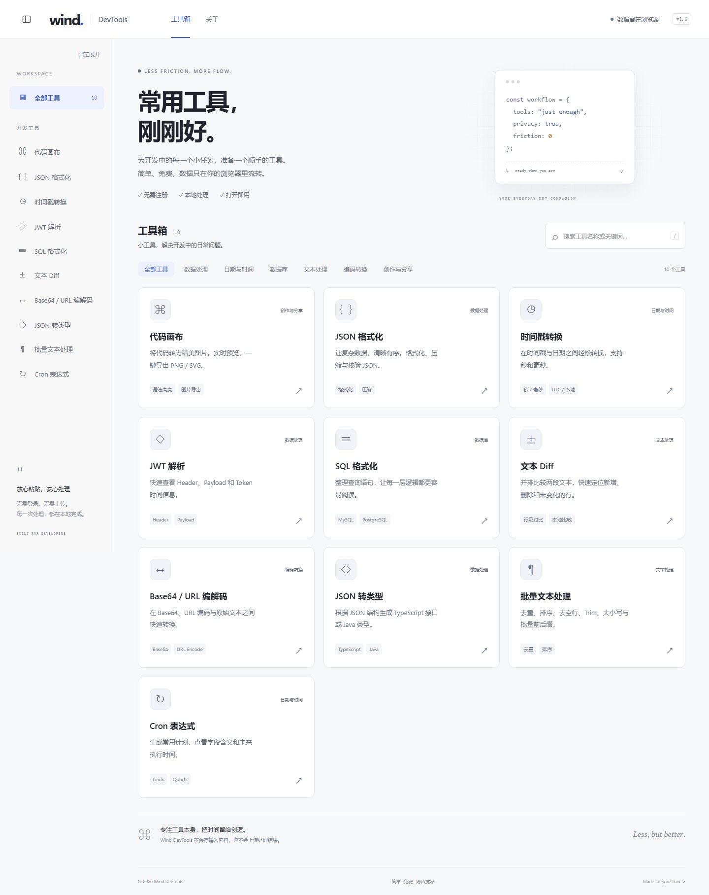
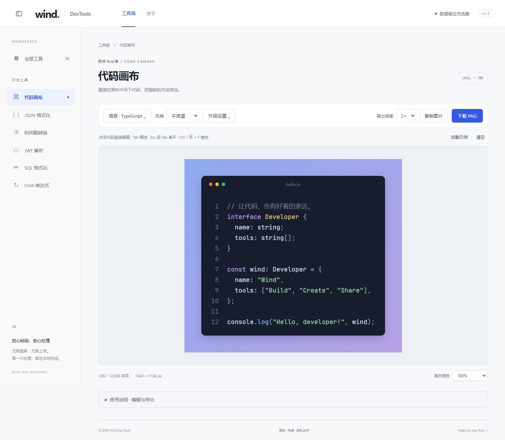

<div align="center">

# Wind DevTools

**常用工具，刚刚好。**

为开发中的小任务，准备一套顺手的工具。<br/>
格式化数据、对比文本、转换类型，也把代码变成好看的图片。

<p>
  
  
  
</p>

**免费使用 · 无需登录 · 浏览器本地处理 · 中英切换**

[功能](#功能) · [快速开始](#快速开始) · [部署](#部署) · [文档](#文档) · [反馈建议](https://github.com/LittleSunX/Wind-DevTools-/issues)

<br/>



</div>

## 功能

十个工具，覆盖数据处理、文本整理、编码转换与代码分享。

| 工具 | 能做什么 |
| --- | --- |
| **🎨 代码画布** | 直接在成品画布中编辑代码，复制图片或导出 PNG / SVG |
| **🧩 JSON 格式化** | 格式化、压缩与校验，保留大整数精度，发现重复键 |
| **🕒 时间戳转换** | 秒、毫秒与日期双向转换，支持 UTC 和本地时区 |
| **🔑 JWT 解析** | 查看 Header、Payload 与时间字段，标明过期状态 |
| **🗃️ SQL 格式化** | 整理 MySQL、PostgreSQL、Oracle 查询，调整缩进与大小写 |
| **± 文本 Diff** | 按行比较两段文本，标记新增与删除，复制差异结果 |
| **↔ Base64 / URL 编解码** | UTF-8 文本的 Base64 编解码与 URL 百分号编码转换 |
| **〈〉JSON 转类型** | 根据 JSON 样例生成 TypeScript 接口或 Java 类 |
| **¶ 批量文本处理** | 按行去重、排序、去空行、去首尾空白，转换大小写、添加前后缀 |
| **⏱️ Cron 表达式** | Linux / Quartz 常用语法，快捷生成并查看未来执行时间 |

所有可下载的结果都会在文件名中附上本地日期、时间和毫秒，保留原有文件格式。

### 让代码，也有好看的表达

**编辑的地方，就是作品本身。** 在代码画布中直接输入代码、修改窗口标题，调整后的外观即时呈现，导出复用同一份画布内容。

- **写得顺手**：支持 28 种语言与格式，语言可搜索，提供语法高亮、Tab 缩进、撤销和查找；也可选择或拖入本地代码文件。
- **调成喜欢的样子**：六套风格预设，搭配主题、自定义渐变、纯色或透明背景；字体、字号、行高、边距、窗口样式、圆角和阴影均可调整。
- **控制画面细节**：设置起始行号与高亮行，选择画布比例、固定宽度和长行自动换行；查看时可缩放，不改变导出尺寸。
- **随时带走作品**：复制 PNG 图片，或下载 **1× / 2× / 3× PNG** 与 **SVG**。高级复制提供 SVG 源码、PNG Data URL 和 Base64，下载文件按日期时间及毫秒命名，无水印。

选择预设后，可以继续通过「外观设置」调整；偏离预设时，风格显示为「自定义」。

<details>
<summary><strong>展开查看代码画布</strong></summary>

<br/>



</details>

### 从处理结果，到分享图片

在支持的工具结果区点击「发送到代码画布」，即可带着处理结果继续排版，无需再复制粘贴。桌面侧栏可收起为图标栏，闲置 30 秒后自动收起，也可固定展开，让内容拥有更多空间。

### 用熟悉的语言工作

右上角可切换中文与 English。中文页面保留 `/tools/...`，英文页面使用 `/en/tools/...`；切换无需刷新，当前输入、处理结果和画布设置保持不变。生产构建会为两种语言分别预渲染页面并输出 canonical、hreflang 与双语 sitemap。界面语言与代码高亮语言分别设置。

## 快速开始

使用 **Node.js 22** 和 **npm**：

```sh
git clone https://github.com/LittleSunX/Wind-DevTools-.git
cd Wind-DevTools-
npm ci
npm run dev
```

打开 [localhost:5173/tools](http://localhost:5173/tools)，即可使用全部工具。

本地预览生产版本：

```sh
npm run build
npm run preview
```

预览地址为 [localhost:4173/tools](http://localhost:4173/tools)。

## 部署

### Vercel（推荐）

[](https://vercel.com/new/clone?repository-url=https%3A%2F%2Fgithub.com%2FLittleSunX%2FWind-DevTools-&project-name=wind-devtools&repository-name=wind-devtools)

1. 点击上方 **Deploy** 按钮。
2. 登录 Vercel，按提示将项目保存到自己的 GitHub 仓库。
3. 确认框架为 **Vite**，构建命令为 `npm run build`，输出目录为 `dist`。
4. 点击 **Deploy**，等待构建完成即可访问。

> 正式上线后，将 `SITE_URL` 设置为实际站点地址并重新部署，以生成搜索引擎收录配置。未设置时，默认禁止收录。

部署已有仓库、自托管和 Umami 配置，见 [部署指南](docs/deployment.md)。

## 文档

| 文档                            | 内容                                   |
| ------------------------------- | -------------------------------------- |
| [使用指南](docs/usage.md)       | 快捷操作、输入格式、隐私与工具使用范围 |
| [部署指南](docs/deployment.md)  | Vercel、静态托管、域名与可选统计       |
| [开发指南](docs/development.md) | 技术栈、项目结构、测试命令与新增工具   |

工具输入与处理结果在浏览器中处理，不上传服务器，刷新后不自动恢复。主动发送到代码画布时，内容通过当前标签页的临时存储传递，画布读取后立即删除；外观与侧栏偏好保存在本机。JWT 解析不验证签名；启用可选统计时，仅发送允许的页面与操作信息，详见使用指南。

---

<div align="center">

发现问题，或有想用的工具？[提交 Issue](https://github.com/LittleSunX/Wind-DevTools-/issues)。

**把时间留给创造。**

</div>
